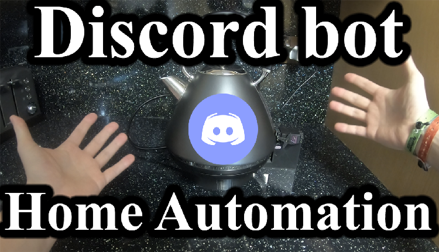

# Discord Kettle
Using the Discord API to tell an Arduino to turn on my Kettle.
My PC is a far way from my kitchen, so to save a trip, I use the Discord API to send a command to an Arduino to run a Servo Motor to turn on my kettle.
The Kettle is on a weigh scale, and will prevent running if there is not enough water in the kettle (by weight).
There is also a thermometer attached to the kettle, so that I know when the kettle has boilt.

# Watch YouTube Video

https://www.youtube.com/watch?v=3nnZLybTLSI&t=252s
